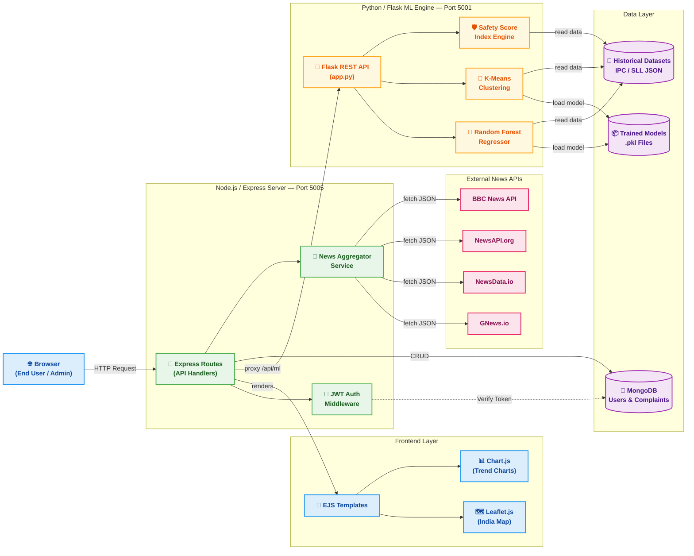
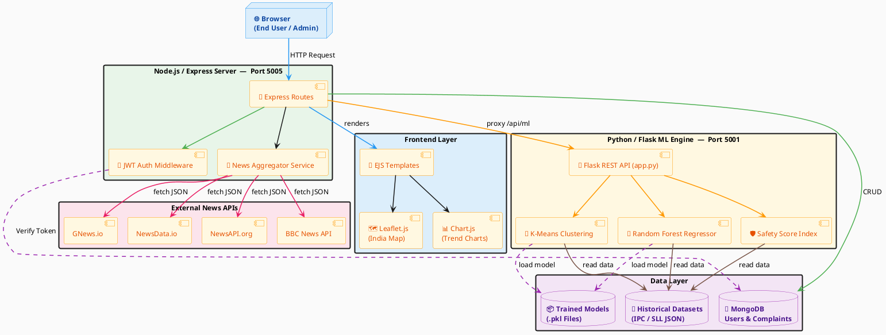

# 🏗️ System Architecture Diagram — Crime Analysis ML Platform

Inspired by the `diagrams` library style — clusters, colored edges, and labeled connections.

---

## Mermaid Version

---

## PlantUML Version

