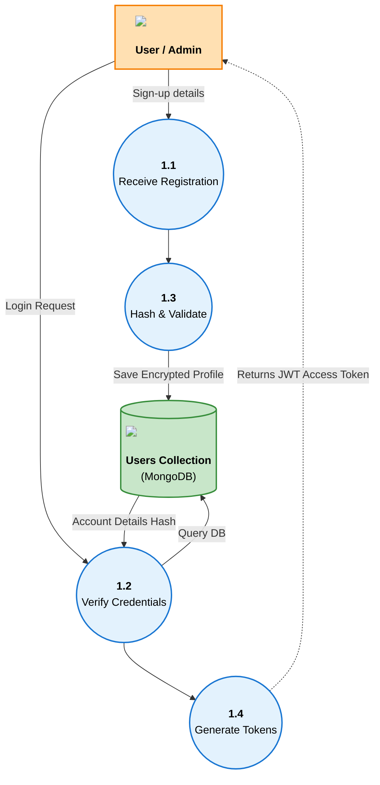
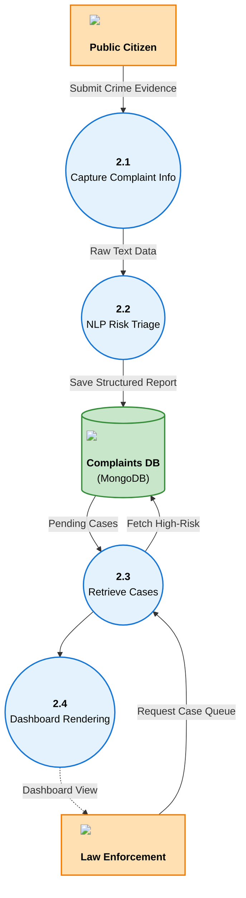
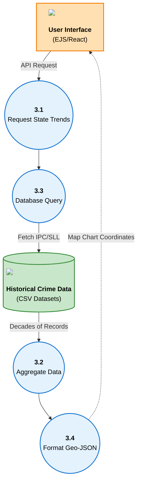
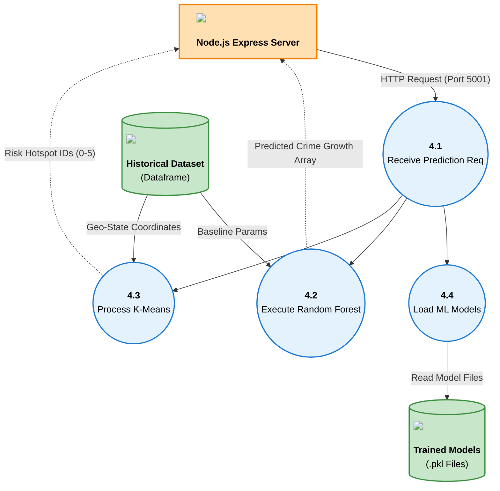
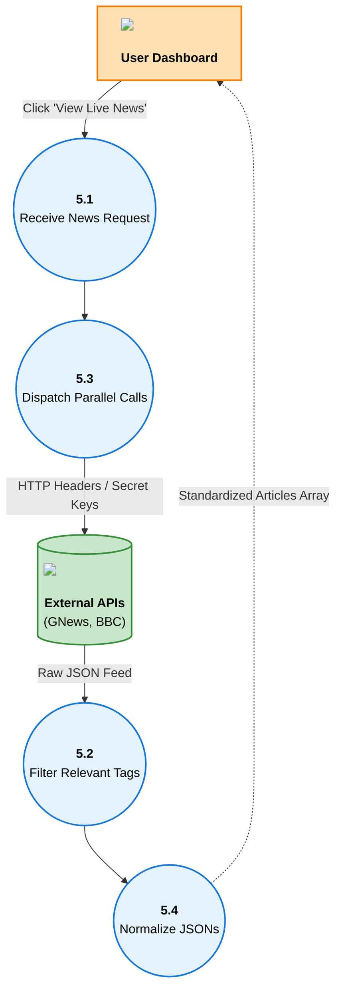

# 📊 Module-Wise Data Flow Diagrams (DFD)

This document contains specialized Level 1/Level 2 Data Flow Diagrams representing the isolated data processing architecture for every individual module within the Crime Analysis ML System.

> **Update:** Aligned the structural geometry perfectly to match the sample diagrams (Horizontal and Vertical tree branching with top-down flow). Implemented bulletproof Wikipedia & Devicon raw SVGs for all database, UI, and user entities to guarantee they render securely in all markdown viewers. Custom color themes (Orange Actors, Blue Processes, Green Databases) have been added to match the visual standard.

---

## 1. Authentication & User Management Module
This module handles secure access, distinguishing between public citizens and police administrators.

---

## 2. Complaint Reporting & Triage Module
This module is responsible for capturing public crime reports and predicting priority using NLP.

---

## 3. Dashboard & Data Visualization Module
This module aggregates large JSON/CSV datasets and returns visual summaries for geographic plotting.

---

## 4. Machine Learning Engine Module
The core Python-based process using Scikit-Learn to forecast future trends based on existing statistical models.

---

## 5. Live News Aggregation Module
This module handles fetching external live feeds seamlessly and combining them into a unified list.

