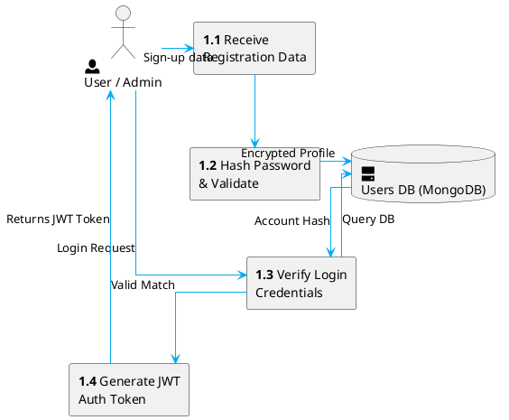
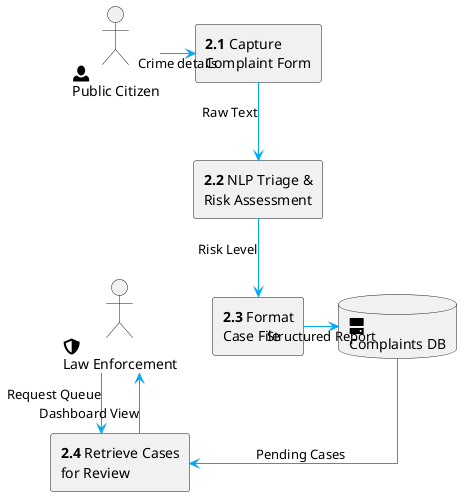
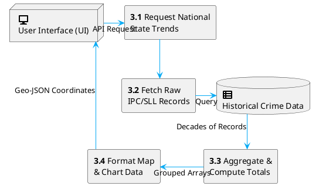
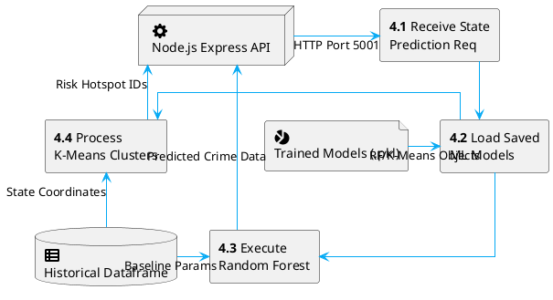
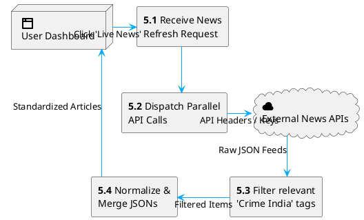

# 🌱 Module-Wise Data Flow Diagrams (PlantUML)

This document contains specialized Level 1 / Level 2 Data Flow Diagrams representing the internal data processing architecture for every module.

> **Update**: These models have been configured with `skinparam linetype ortho` paired with precise directional flow (`-up->`, `-down->`, etc.) to enforce strict horizontal and vertical (orthographic) lines. This prevents messy diagonal crossovers. Additionally, high-quality native PlantUML SVG vectors (`<&icon>`) have been embedded into all structural entities for easy visualization.

---

## 1. Authentication & User Management Module

---

## 2. Complaint Reporting & Triage Module

---

## 3. Dashboard & Data Visualization Module

---

## 4. Machine Learning Engine Module

---

## 5. Live News Aggregation Module

