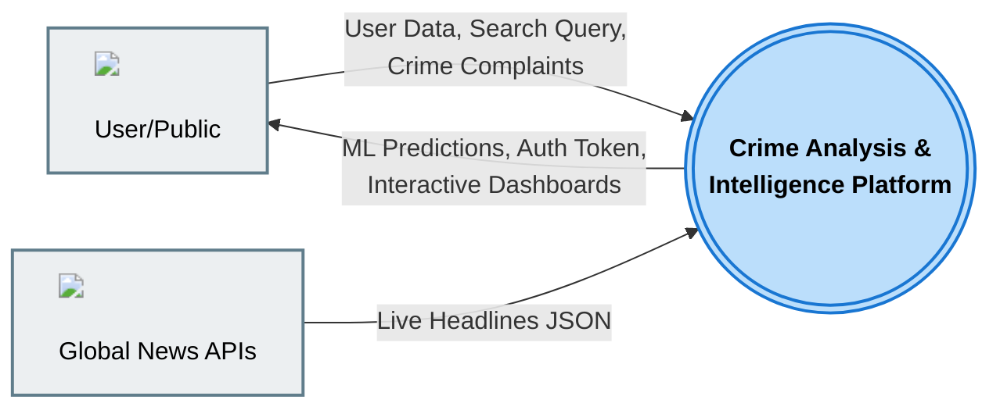
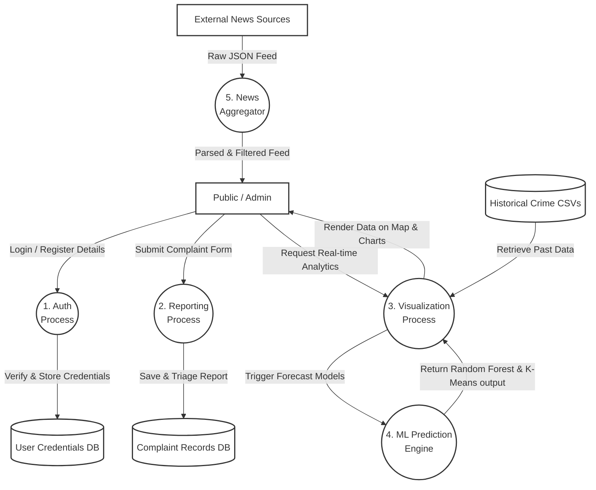
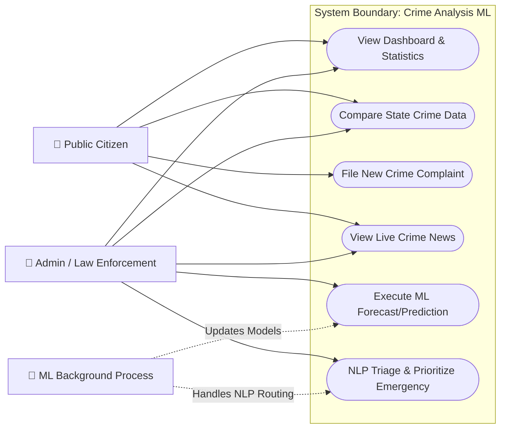
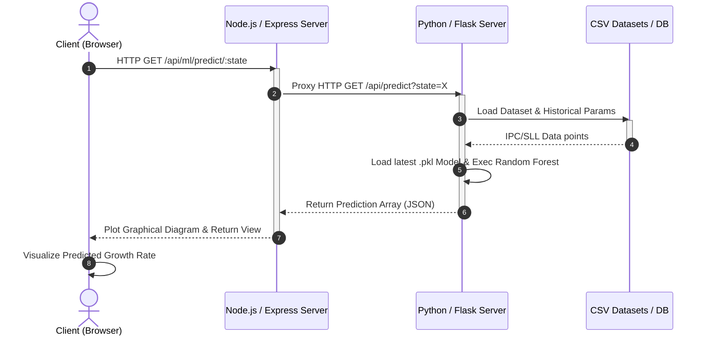

# 🏛️ Crime Analysis & Intelligence System - Architecture & Design

This document covers the complete system architecture, hardware/software requirements, feasibility study, modules, and UML design diagrams for the Indian Crime Intelligence & ML Prediction platform.

## 🛠️ Hardware & Software Requirements

### Hardware Requirements
- **Processor:** Intel Core i3 (or equivalent) and above
- **Memory (RAM):** 8 GB Minimum (16 GB Recommended for training Machine Learning models)
- **Storage:** 20 GB free disk space
- **Display:** Minimum 1024 × 768 resolution (Color display)
- **Network:** Active internet connection (Required for live News APIs and map tiles)

### Software Requirements
- **Operating System:** Windows 10/11, macOS, or Linux
- **Backend Environment:** Node.js (v18+) and Python 3.9+
- **Database:** MongoDB Community Server (Local) or MongoDB Atlas
- **Web Browser:** Google Chrome, Edge, or Mozilla Firefox (latest versions)
- **Frameworks & Libs:** Express.js, Flask, Scikit-learn, Mongoose, EJS, Leaflet.js, Chart.js

---

## 🧩 Modules Description

1. **Dashboard & Data Visualization Module**
   - Renders interactive maps (using Leaflet.js) to display crime density across India.
   - Provides graphical charts (pie, bar) of state-wise and national IPC/SLL crimes over the past decades.
2. **Machine Learning & Prediction Module (Flask Engine)**
   - Utilizes Random Forest and Linear Regression to forecast future crime rates based on historical data.
   - Includes a K-Means clustering algorithm to categorize states into 5 safety/risk levels (hotspots).
3. **Complaint Reporting & Triage Module**
   - Allows citizens and authenticated users to file complaints securely.
   - Employs Natural Language Processing (NLP) to triage and prioritize high-risk emergency cases.
4. **Live News Aggregation Module**
   - Connects with multiple external feeds (GNews, NewsData, NewsAPI, BBC).
   - Aggregates and filters live crime-related news specifically tailored to Indian locations.
5. **Authentication & User Management**
   - Controls access using secure JWT (JSON Web Tokens) verification.
   - Differentiates roles and visibility between normal public users and administrative law enforcement personnel.

---

## ⚖️ Feasibility Study

- **Technical Feasibility:**
  The system utilizes well-established, open-source technology frameworks. Integrating Python for machine learning calculations and Node.js for asynchronous web request handling allows the platform to be highly decoupled, scalable, and responsive. 
- **Economic Feasibility:**
  Since the core technologies (Node.js, Express, Flask, MongoDB) and frontend libraries are entirely open source and free to use, the initial software expenditure is virtually zero. The external API endpoints used have free tiers accommodating academic/standard requirements.
- **Operational Feasibility:**
  The solution automates the major pain points in crime analysis (data crunching & prediction visualization). Its User Interface is designed to be accessible and modern (incorporating "Glassmorphism" design patterns), ensuring that complex data is easily digestible for both law enforcement administrators and the general public.

---

## 🏗️ 1. System Architecture Diagram

```mermaid
graph TD
    classDef default fill:#f9f9f9,stroke:#333,stroke-width:2px,color:#000;
    classDef client fill:#e1f5fe,stroke:#03a9f4,stroke-width:2px,color:#000;
    classDef server fill:#e8f5e9,stroke:#4caf50,stroke-width:2px,color:#000;
    classDef ml fill:#fff3e0,stroke:#ff9800,stroke-width:2px,color:#000;
    classDef db fill:#f3e5f5,stroke:#9c27b0,stroke-width:2px,color:#000;

    User["<br/><b>End User / Admin</b>"]:::client
    Browser["<br/><b>Web Interface</b><br/>(EJS, Leaflet, Chart.js)"]:::client
    
    NodeServer["<br/><b>Node.js + Express API</b><br/>(Backend logic, Port 5005)"]:::server
    
    FlaskML["<br/><b>Flask ML Engine</b><br/>(scikit-learn, Port 5001)"]:::ml
    
    Mongo["<br/><b>MongoDB</b><br/>(Users & Complaints)"]:::db
    
    NewsAPI["<br/><b>External Live News APIs</b>"]:::default

    User -->|Interacts via| Browser
    Browser <-->|HTTP Requests (REST API)| NodeServer
    NodeServer <-->|Fetch JSON Feed| NewsAPI
    NodeServer <-->|CRUD Operations| Mongo
    NodeServer <-->|Request ML Predictions| FlaskML
```

---

## 🔄 2. Data Flow Diagram (DFD)

### Level 0 DFD (Context Diagram)



### Level 1 DFD



---

## 🏗️ 3. UML Diagrams

### Use Case Diagram (System Interactions)



### Sequence Diagram (Prediction Flow)


