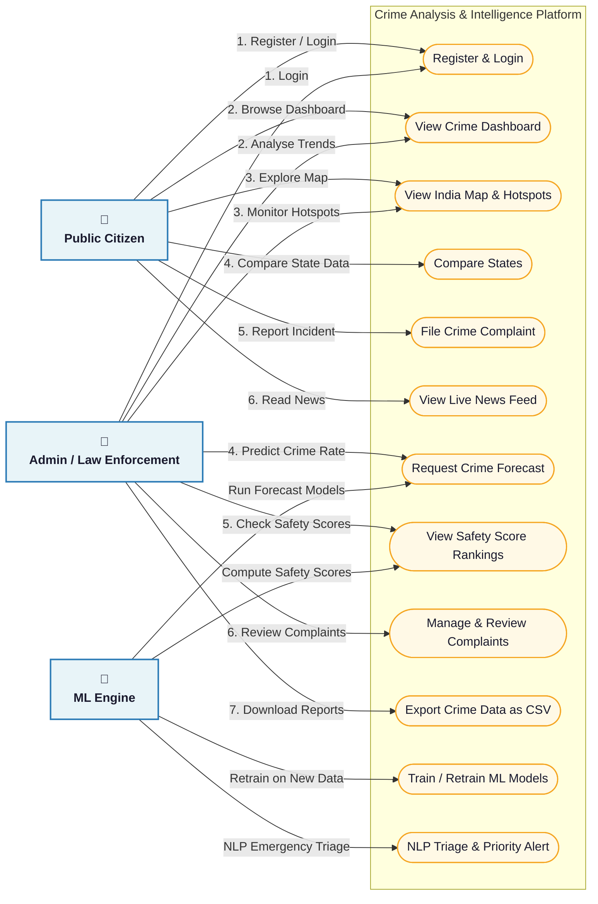

# 🎯 Use Case Diagram — Crime Analysis ML Platform (Mermaid)

---

```mermaid
flowchart LR
    classDef actor fill:#e8f4f8,stroke:#2c7bb6,stroke-width:2px,color:#1a1a2e,font-weight:bold
    classDef usecase fill:#fff9e6,stroke:#f5a623,stroke-width:1.5px,color:#1a1a2e
    classDef system fill:#f0f8ff,stroke:#2c7bb6,stroke-width:2px,color:#2c7bb6

    %% ── Actors ──
    Citizen["👤<br/><b>Public Citizen</b>"]:::actor
    Admin["👮<br/><b>Admin / Law Enforcement</b>"]:::actor
    ML["🤖<br/><b>ML Engine</b>"]:::actor

    %% ── Use Cases inside System Boundary ──
    subgraph SYS["  Crime Analysis & Intelligence Platform  "]
        UC1(["Register & Login"]):::usecase
        UC2(["View Crime Dashboard"]):::usecase
        UC3(["View India Map & Hotspots"]):::usecase
        UC4(["Compare States"]):::usecase
        UC5(["File Crime Complaint"]):::usecase
        UC6(["View Live News Feed"]):::usecase
        UC7(["Request Crime Forecast"]):::usecase
        UC8(["View Safety Score Rankings"]):::usecase
        UC9(["Manage & Review Complaints"]):::usecase
        UC10(["Export Crime Data as CSV"]):::usecase
        UC11(["Train / Retrain ML Models"]):::usecase
        UC12(["NLP Triage & Priority Alert"]):::usecase
    end

    %% ── Citizen Connections ──
    Citizen -- "1. Register / Login" --> UC1
    Citizen -- "2. Browse Dashboard" --> UC2
    Citizen -- "3. Explore Map" --> UC3
    Citizen -- "4. Compare State Data" --> UC4
    Citizen -- "5. Report Incident" --> UC5
    Citizen -- "6. Read News" --> UC6

    %% ── Admin Connections ──
    Admin -- "1. Login" --> UC1
    Admin -- "2. Analyse Trends" --> UC2
    Admin -- "3. Monitor Hotspots" --> UC3
    Admin -- "4. Predict Crime Rate" --> UC7
    Admin -- "5. Check Safety Scores" --> UC8
    Admin -- "6. Review Complaints" --> UC9
    Admin -- "7. Download Reports" --> UC10

    %% ── ML Engine Connections ──
    ML -- "Run Forecast Models" --> UC7
    ML -- "Compute Safety Scores" --> UC8
    ML -- "Retrain on New Data" --> UC11
    ML -- "NLP Emergency Triage" --> UC12
```
