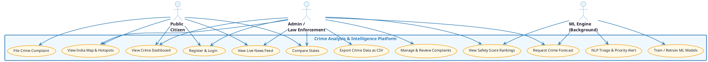

# 🎯 Use Case Diagram — Crime Analysis ML Platform

Simple, clean use case diagram showing all actors and their key interactions with the system.

---

```plantuml
@startuml
!pragma layout smetana

skinparam backgroundColor #ffffff
skinparam defaultFontName Arial
skinparam defaultFontSize 12

skinparam actor {
    BackgroundColor #e8f4f8
    BorderColor #2c7bb6
    FontColor #1a1a2e
    FontStyle bold
    FontSize 13
}

skinparam usecase {
    BackgroundColor #fff9e6
    BorderColor #f5a623
    FontColor #1a1a2e
    FontSize 11
    BorderThickness 1.5
}

skinparam rectangle {
    BackgroundColor #f0f8ff
    BorderColor #2c7bb6
    BorderThickness 2
    FontColor #2c7bb6
    FontStyle bold
    FontSize 13
}

skinparam ArrowColor #2c7bb6
skinparam ArrowThickness 1.5

' ─────────────────────────
'  ACTORS (left side)
' ─────────────────────────
:Public\nCitizen: as Citizen
:Admin /\nLaw Enforcement: as Admin
:ML Engine\n(Background): as ML

' ─────────────────────────
'  SYSTEM BOUNDARY
' ─────────────────────────
rectangle "  Crime Analysis & Intelligence Platform  " {

    (Register & Login)              as UC1
    (View Crime Dashboard)          as UC2
    (View India Map & Hotspots)     as UC3
    (Compare States)                as UC4
    (File Crime Complaint)          as UC5
    (View Live News Feed)           as UC6
    (Request Crime Forecast)        as UC7
    (View Safety Score Rankings)    as UC8
    (Manage & Review Complaints)    as UC9
    (Export Crime Data as CSV)      as UC10
    (Train / Retrain ML Models)     as UC11
    (NLP Triage & Priority Alert)   as UC12

}

' ─────────────────────────
'  CITIZEN CONNECTIONS
' ─────────────────────────
Citizen --> UC1
Citizen --> UC2
Citizen --> UC3
Citizen --> UC4
Citizen --> UC5
Citizen --> UC6

' ─────────────────────────
'  ADMIN CONNECTIONS
' ─────────────────────────
Admin --> UC1
Admin --> UC2
Admin --> UC3
Admin --> UC4
Admin --> UC6
Admin --> UC7
Admin --> UC8
Admin --> UC9
Admin --> UC10

' ─────────────────────────
'  ML ENGINE CONNECTIONS
' ─────────────────────────
ML --> UC11
ML --> UC12
ML --> UC7
ML --> UC8

@enduml
```
